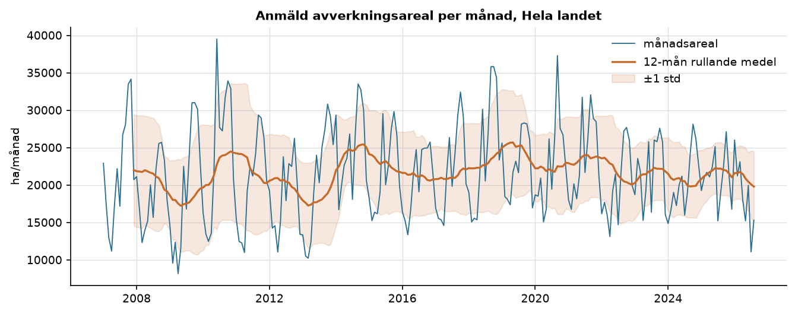
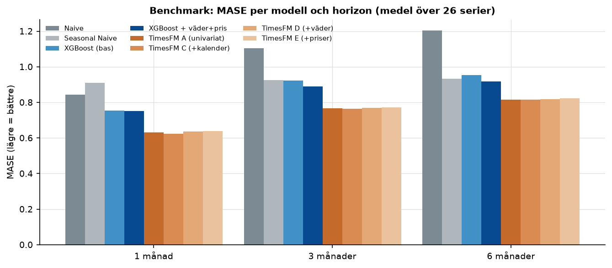
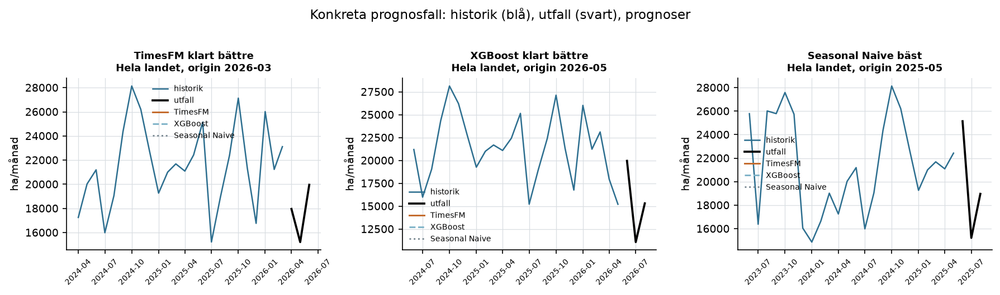

# Forest Supply Forecast

**Kan man prognostisera svensk skoglig avverkningsaktivitet 1–6 månader framåt
med endast öppna data — och slår TimesFM 3 de klassiska metoderna?**

Detta är ett personligt portföljprojekt som undersöker frågan med modern
tidsserietestning: rolling-origin-backtesting, fyra modellfamiljer och en
redundant öppen datakedja (Skogsstyrelsen + SMHI) som uppdateras med ett kommando.

🔗 **Live-dashboard:** körs på Streamlit Cloud — länk läggs in här vid publicering.

**Om namnet:** "supply" syftar på användningsområdet — prognosen är en *ledande
indikator* för kommande råvarutillförsel (anmälan föregår avverkning, som blir
virkesvolym). Målvariabeln är areal (ha), inte virkesvolym (m³fub); appen erbjuder
därför en **indikativ volymvy** där prognosbandet omvandlas med landsdelens
genomsnittliga slutavverkningsfaktor (m³sk/ha, Skogsstyrelsen JO0312_06).

> **Avgränsning:** projektet använder offentlig proxy-data och är **inte** ett
> Södra-projekt; resultaten säger inget om Södras interna data eller prognosprecision.



## Problem

Skogsnäringen planerar råvaruflöden månader i förväg: inköp av virke,
kapacitet i sågverk/fabriker, logistik och prissättning vilar på uppskattningar
av framtida avverkningsvolym. Offentlig statistik om **avverkningsanmälningar**
(Skogsstyrelsen) publiceras månadsvis och är en tidig, oberoende proxy för
kommande råvaruaktivitet. Frågan är om den är prognostiserbar — och om en
foundation-modell för tidsserier (Google TimesFM 3, zero-shot) slår enklare
alternativ. Specifikationen var metodöppen: baselines är likvärdiga kandidater,
och ett utfall där TimesFM *förlorar* är lika intressant.

## Data (allt öppet, hämtat via API, reproducerbart)

| Roll | Källa | Innehåll |
| ---- | ----- | -------- |
| Målvariabel | [Skogsstyrelsen PX-Web, tabell 05](https://pxweb.skogsstyrelsen.se/pxweb/sv/Skogsstyrelsens%20statistikdatabas/) | Anmäld + ansökt avverkningsareal (ha/månad), 2007M01–, 21 län + 4 landsdelar + riket |
| Priser | Skogsstyrelsen JO0303_3ny | Kvartalsvisa avräkningspriser (kr/m³fub) per landsdel/sortiment, 2019K1– |
| Väder | [SMHI MetObs](https://opendata.smhi.se/metobs/) | Temperatur/nederbörd (månad) + snödjup (dygn), ca 900 stationer → nationellt aggregerade |

Detaljerad källkritik, API-särdrag och stationstäckning: [docs/data_inventory.md](docs/data_inventory.md).

## Metod

- **Terminologi:** målvariabeln är *anmäld* areal — en **proxy**, inte faktisk avverkning.
- **Utvärdering:** rolling-origin-backtesting, en startpunkt per månad 2022M09–2026M08
  (48 startpunkter), alla 26 serier, horisonterna 1/3/6 månader ⇒ **ca 35 000 prognosvärden**.
  Vid varje startpunkt ser modellen endast data ≤ startpunkten (hårt läckagetest i testsviten).
- **Modeller:** Naive, Seasonal Naive (m=12), XGBoost (direkt prognos för flera
  horisonter; förskjutna värden 1/2/3/6/12, rullande medel/std, kalender; omträning
  vid varje startpunkt) och **Google TimesFM 3.0** (330M, zero-shot, MLX-backend
  på Apple Silicon) i fem varianter: univariat (A), multivariat över län/toppserier (B),
  +kalender (C), +väder (D), +priser (E).
- **Felmått:** MAE, RMSE, MASE (skalad mot träningsdelens säsongscykler), sMAPE —
  alla beräknas om ur råa prediktionsfiler.
- **Parquet genom hela kedjan:** raw (JSON/CSV) → processed (parquet via
  `python -m src.data.transform`) → modeller/app läser via loader-funktioner.
  Nya månadsdata sprider sig automatiskt genom allt.



## Resultat (MASE, medel över 26 serier — lägre är bättre)

| Modell | 1 mån | 3 mån | 6 mån |
| ------ | ----: | ----: | ----: |
| Naive | 0,84 | 1,10 | 1,21 |
| Seasonal Naive | 0,91 | 0,93 | 0,93 |
| XGBoost (bas) | 0,75 | 0,92 | 0,95 |
| XGBoost + väder + pris | 0,75 | 0,89 | 0,92 |
| **TimesFM A (univariat)** | **0,63** | 0,77 | 0,82 |
| TimesFM C (+kalender) | 0,62 | 0,76 | 0,81 |
| TimesFM D (+väder) | 0,64 | 0,77 | 0,82 |
| TimesFM E (+priser) | 0,64 | 0,77 | 0,82 |

Huvudfynd:

1. **TimesFM 3 vinner tydligt på alla horisonter** — 15–20 % lägre MAE än XGBoost
   och ca 25–30 % bättre än Seasonal Naive vid 1 mån. Zero-shot, utan träning på
   svensk skogsdata.
2. **Multivariat korsserieinformation hjälper måttligt på länsnivå**
   (MASE 0,61/0,72/0,77) men ger i praktiken ingen förbättring på toppserierna.
3. **Väder- och pris-kovariater tillför praktiskt taget inget** — marginellt
   *sämre* för TimesFM. Kalender är den enda kovariat som förbättrar resultaten
   (praktiskt taget gratis: modellen ser redan månadsrytmen i sin kontext).
4. **Baselines vinner vid regimskiften:** Seasonal Naive är starkast vid flera
   svåra startpunkter (t.ex. startpunkt 2025-06: MAE 1 946 ha mot TimesFMs 6 376) —
   när nivån skiftar men säsongsmönstret håller vinner naiv säsongsupprepning.
5. **Prognosintervall (P10–P90):** täckning ca 79 % vid 1 mån (nominellt 80 %) men
   ca 60 % vid 6 mån — intervallet är för smalt på längre horisonter; kalibrering
   krävs före beslutsanvändning.

Fullständiga tabeller per region/horisont: [outputs/results/](outputs/results/),
resultatrapport: [docs/experiments_results.md](docs/experiments_results.md).

## Felanalys

- Felen koncentreras till **övergångsmånaderna** (aug–okt) där anmälan rusar —
  modeller som missar säsongens *timing* tar stryk ([docs/error_analysis.md](docs/error_analysis.md)).
- Svagaste serier för TimesFM: volatila småregioner (Gävleborg, Dalarna) där
  enskilda stora avverkningar dominerar månadsbilden.
- Konkreta fall (TimesFM vinner / XGBoost vinner / Seasonal Naive vinner)
  visualiseras i figuren nedan.



## Affärsperspektiv

Prognoser med denna metodik kan vara beslutsstöd för:

- **Råvaruplanering:** 3–6-månadersprognoser per landsdel ger en tidig indikation
  om avverkningsaktiviteten förväntas stiga eller falla inför inköps- och
  produktionsplanering.
- **Leveranskedja och kapacitet:** prognosbanden (P10–P90) kan användas för
  scenarioplanering av transport- och beredningskapacitet.
- **Inköpsstrategi:** förväntad aktivitetsnivå påverkar prisförhandlingar och
  upphandlingsfrekvens.

Viktiga reservat: målvariabeln är anmälningar (inte leveranser), regionaliteten är
län/landsdel (inte Södras medlems- eller leveransgeografi), och en produktiv
vidareutveckling vore Södras interna data + kalibrerade intervall + lokala kovariater.

## Begränsningar

Se [docs/limitations.md](docs/limitations.md) — kort sagt: proxy-målvariabel
(anmälan ≠ avverkning), ca 19 år månadsdata, metodändring i prisstatistiken 2025K2,
väder endast nationellt aggregerat, TimesFM 3.0:s vikter är **icke-kommersiella**
(forskning/demonstration, inte produktion), och P10–P90 behöver kalibrering på
längre horisonter.

## Reproducerbarhet

```bash
uv venv --python 3.12 && source .venv/bin/activate
uv pip install -e ".[dev,timesfm-mlx]"   # Apple Silicon; annars timesfm-torch

python scripts/01_data_discovery.py        # verifiera datakällor
python -m src.data.download_data           # hämta raw (idempotent, med sha256-manifest)
python -m src.data.transform               # processed → parquet
python scripts/03_eda.py                   # EDA + figurer
python scripts/05_baselines.py             # Naive, Seasonal Naive
python scripts/06_xgboost.py               # XGB base/wx/full
python scripts/07_timesfm_univariate.py    # A
python scripts/08_timesfm_multivariate.py  # B
python scripts/09_timesfm_covariates.py    # C/D/E
python scripts/10_benchmark.py             # tabeller + figur
python scripts/11_error_analysis.py        # felanalys
python scripts/12_final_forecast.py        # prognoser för senaste startpunkten
streamlit run app/streamlit_app.py         # dashboard (med indikativ volymvy)
pytest                                     # 26 tester (data/features/leakage/metrics)
```

Alla experiment använder fast seed, kronologiska splits, gemensamma startpunkter
och sparar råa prediktioner — felmåtten kan alltid återskapas från
`outputs/predictions/`. Datahämtning loggas med URL, tidpunkt och sha256 i
`data/raw/download_manifest.json`.

## Projektstruktur

```text
scripts/    körbara steg per fas (01–12) — inga notebooks
src/
  data/         PX-Web-klient, SMHI-klient, priser, download, transform (parquet), loaders
  features/     lag/rolling/calendar/kovariat-features med hårt läckageskydd
  models/       naive, seasonal_naive, xgboost_model, timesfm_model (MLX)
  evaluation/   felmått (MAE/RMSE/MASE/sMAPE) + rolling-origin-utvärderare
  visualization/plots.py
app/        Streamlit-dashboard
tests/      26 tester: reshape, datumindex, läckage, kvantiler, prisregel
docs/       data_inventory, methodology, eda_findings, experiments_results,
            error_analysis, limitations
data/       raw (git-ignore: hämtas via script) / processed (parquet, i repot)
outputs/    figures / predictions / results (i repot; genereras av skripten)
```

## Licens

Projektkod: MIT ([LICENSE](LICENSE)). TimesFM 3.0:s modellvikter licensieras separat
av Google med **icke-kommersiell** licens — resultat som bygger på dem är avsedda
för forskning/demonstration, inte produktionssättning.
