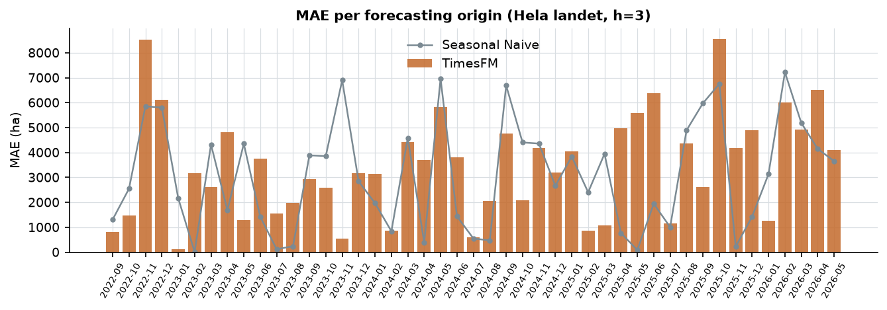

# Error analysis (fas 11)

*Auto-genererad av scripts/11_error_analysis.py.*

### Säsongsbias (Hela landet)

- **Naive**: total bias +768 ha/mån; störst säsongsbias i månad 10 (-11,755 ha).
- **Seasonal Naive**: total bias +104 ha/mån; störst säsongsbias i månad 1 (-2,463 ha).
- **XGBoost**: total bias +397 ha/mån; störst säsongsbias i månad 7 (+6,817 ha).
- **TimesFM**: total bias +578 ha/mån; störst säsongsbias i månad 7 (+5,003 ha).

Mönstret: fel koncentreras till övergångsmånaderna (framför allt sommaren augusti-september när anmälan rusar) - modeller som hänger med i nivåskift men missar säsongens *timing* tar stryk där.

### Svåraste origins (h=3, Hela landet)

- **2025-10**: TimesFM MAE 8,550 ha, SNaive 6,754, XGB 10,376 - prognosmånaderna 2025-11–2026-01.
- **2022-11**: TimesFM MAE 8,519 ha, SNaive 5,854, XGB 9,267 - prognosmånaderna 2022-12–2023-02.
- **2026-04**: TimesFM MAE 6,518 ha, SNaive 4,146, XGB 10,583 - prognosmånaderna 2026-05–2026-07.
- **2025-06**: TimesFM MAE 6,376 ha, SNaive 1,946, XGB 7,568 - prognosmånaderna 2025-07–2025-09.
- **2022-12**: TimesFM MAE 6,120 ha, SNaive 5,803, XGB 8,516 - prognosmånaderna 2023-01–2023-03.

### Vem vinner var (h = 3)?

- TimesFM: bäst i 20 av 26 serier.
- Seasonal Naive: bäst i 6 av 26 serier.

Svåraste serier för TimesFM (h=3): Hela landet (MAE 3,457), Södra Norrland (MAE 1,552), Svealand (MAE 996) - volatila småserier och övergångsregioner.

### Tre konkreta fall (h = 3, prognoser mot utfall)

- **TimesFM klart bättre** (Hela landet, origin 2026-03): XGBoost MAE 139, Naive MAE 3,157, TimesFM MAE 4,927, Seasonal Naive MAE 5,186
- **XGBoost klart bättre** (Hela landet, origin 2026-05): Naive MAE 100, Seasonal Naive MAE 3,654, TimesFM MAE 4,092, XGBoost MAE 9,802
- **Seasonal Naive bäst** (Hela landet, origin 2025-05): Seasonal Naive MAE 87, Naive MAE 3,464, TimesFM MAE 5,572, XGBoost MAE 8,045

### Prognosintervall (P10–P90, Hela landet)

- h=1: 79% av utfallen inom intervallet (medelbredd 7,169 ha). Nominal 80% - täckningen är rimlig.
- h=3: 62% av utfallen inom intervallet (medelbredd 8,345 ha). Nominal 80% - täckningen avviker från rimlig.
- h=6: 60% av utfallen inom intervallet (medelbredd 8,906 ha). Nominal 80% - täckningen avviker från rimlig.

Intervallen är prognosfördelningar, inte garantier - och kalibreringen kan skifta över tid (kolla per origin innan beslut).
